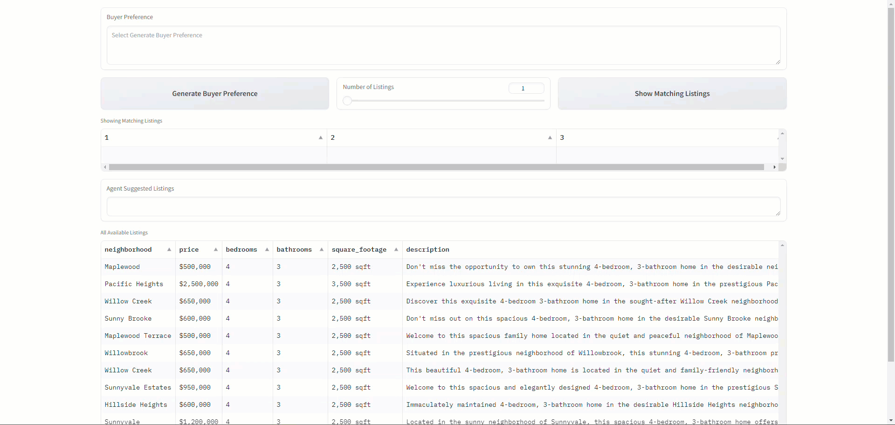

# Personalized Real Estate Agent Project
This project is a personalized real estate agent that helps you find the best house for you.  The project is a requirement for the Udacity Generative AI Nanodegree certificate.

## Project Overview
### Project Introduction
Imagine you're a talented developer at "Future Homes Realty", a forward-thinking real estate company. In an industry where personalization is key to customer satisfaction, your company wants to revolutionize how clients interact with real estate listings. The goal is to create a personalized experience for each buyer, making the property search process more engaging and tailored to individual preferences.

### The Challenge
Your task is to develop an innovative application named "HomeMatch". This application leverages large language models (LLMs) and vector databases to transform standard real estate listings into personalized narratives that resonate with potential buyers' unique preferences and needs.

#### Core Components of "HomeMatch"
##### Understanding Buyer Preferences:

Buyers will input their requirements and preferences, such as location, property type, budget, amenities, and lifestyle choices.
The application uses LLMs to interpret these inputs in natural language, understanding nuanced requests beyond basic filters.
#####  Integrating with a Vector Database:

Connect "HomeMatch" with a vector database, where all available property listings are stored.
Utilize vector embeddings to match properties with buyer preferences, focusing on aspects like neighborhood vibes, architectural styles, and proximity to specific amenities.
Personalized Listing Description Generation:

For each matched listing, use an LLM to rewrite the description in a way that highlights aspects most relevant to the buyer’s preferences.
Ensure personalization emphasizes characteristics appealing to the buyer without altering factual information about the property. 
##### Listing Presentation:
Output the personalized listing(s) as a text description of the listing.

## Project Output
The project output is a Jupyter notebook that demonstrates the personalized real estate agent and an example app built with gradio that shows the use of the personalized real estate agent.  Below is the example app built with gradio.



## Getting Started
### Prerequisites
The following packages were used in this project:
- Python 3.12
- Pipenv
- lancedb
- openai
- python-dotenv
- gradio
- langchain
- pydantic
- langchain-openai
- pandas

### 1. Install pipenv
```bash
pipenv install
pipenv shell
```

### 2. Clone this repository
```bash
git clone https://github.com/StuKozola/Udacity-GenAI-ND-Personalized-Real-Estate-Agent-Project.git
cd Udacity-GenAI-ND-Personalized-Real-Estate-Agent-Project
```

### 3. Install the required packages
```bash
pip install -r requirements.txt
```

### 4. Open the Jupyter notebook to run the project
The [HomeMatch.ipynb](HomeMatch.ipynb) contains the code for the personalized real estate agent project.  Open the notebook and run the code cells to see the project in action.

